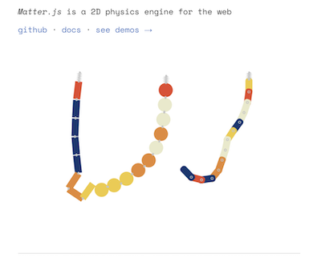

## May 13 2024 - MORNING

Welcome to my second project in master’s thesis. Here I’ll be exploring about sex, physics and humour which should be really COOL. I’m doing this project in partnership with Club Sexu thanks to good old Elspeth McConnell (a small Concordia grant supporting projects with non-profit organizations). The idea is to make a sexy funny game about pleasure, listening to your partner and exploring pleasure with them. Them being a webpage. How can you pleasure a webpage? The entire page? 

I’m will be using matter.js as part of this project and taking inspiration from the relief humour theory to make it funny. 

Brainstorm 1 -

Relief theory + sex + physics engine…. this all seems to make sense. 

The relief theory explains laughter as a release of pent up energy. Like something hat needs no be exteriorized in response to maybe mal aise or taboo or being uncomfortable…. For me this makes me think of an orgasm almost. And matterjs seems to be a good library to explore this through in part, because well it deals with physical things, litteral bodies, and friction and other things that are all part of the sexual language in a sense. So yeah. All this feels tied together in some sort.

I’m also directly thinking about my first ever programming project, “the most incredible programming experience in the world” or something like that, I don’t really remember to be honest. In this really simple project, a series of animated interactive slides would appear one after the other, the player has to click to go to the next one, or do somekind of weird simple activity. Each slide would be talking about what the project itself is, like a trailer of some kind, saying things like “what you are going to experience is the most exciting thing to ever happen to programming…” and building up more and more expectations about what that thing would eventually be. Acoompanying this (very importantly), is the song Opus by Eric Prydz, which already is hilarious because of it has the longest most intense montée in a song that I ever heard. All in all the player starts to find it funny I THINK because everything builds up and they cannot wait for what is going to happen, which is nothing basically, but the point was to make them invested and believe that something huge was coming.

I think playing with a similar arc would definitely be something to think about, a sort of build up. A sexual build up of sorts. Makes me think of Robert Yang’s stick shift, where you have to stick shift a manual car for a dude that gets off more and more as the vitesses go up from 1 to 4, but you have to be careful because if you make a mistake then you start over. 

Im thinking of creating a page, where you have to explore to make the page more and more horny, by doing various things to it. I KNOW IM COPYING PIPPIN BAR. But mine wouldn’t be an interface. The window you are pleasuring would be more experimental, and you would need to explore it to find out how to turn it on, using different things on your computer. Like tickling using the keyboard. Rubbing it in certain ways, maybe even talking to it. Basically get to know it through physicality. There could be sex toys made with matterjs as well. I could start by making a series of matterjs sex toys haha. Yes. Yes yes. 

ANOTHER idea that I would like to implement in this is pop ups. I really want to do something with pop ups. I love them. Maybe opening a bunch of pop ups and closing them in the right order makes the page horny. Or maybe slowing resizing them. OMG thats good. This is actually giving me an idea : you can make a pop up open more and more if you do the right thing, and this pop up reveals something of sorts, a hole maybe? in which you can use the matter js sex toy to pleasure it?? I like the idea of using all the affordances of a web page to make it horny. The sound design of this is going to be awesome to make. I want hot genderless machine sounds. 

I also dont want to make it too interaction designy, more like a weird colorful experience. 

So yeah :

- An arc that pents up energy with a final release
- Browser affordances as sexual foreplay (opening a pop up slowly)
- Matter.js bodies as sex toys or mecanisms for giving pleasure
- Minimal design, basic shapes and colour palette - reminiscent of sexual shapes? metaphor for sex through visuals.

BASICALLY : The player has to *listen* to the webpage in order to pleasure it. It talks to the player through pop ups - and the player has to adjust its behavior in order to make it through the experience. The player also gets asked questions so that both feel they are building something special together? I think it's nice to create something that makes the player feel like their pleasure is also taken into consideration by the page. The page can ask the player if they prefer opening the window fast or slow, or what kind of tools or action they like (or preferred) so they can also feel like their voice is important in building the tension. Try to create a sensation of togetherness, working together. 

Things that happen in sex : 
- Having to take a break to talk
- When you really connect you cum faster
- Sometimes toys or narratives or roleplaying can help to get into it or build connection
- Trying new things can be exciting
- Doing things you are used to can be comforting 
- You remember what the person likes and do it again and start liking it as well 

actions that could become sexual:
- Dark mode = more kinky? (faster or more rough things)
- Typing keyboard fast vs slow = finding a rythm to pleasure the page
- Opening, closing pop ups with a rythm as well, or in the right order
- Pressing buttons 
- Resizing pop ups 
- breathing heavily = growing in size or pulsing rapidly 
- Sounds = breathing and groaning but in a computer way (robot ish?)
- MATTER.JS :
  - The page drops toys and player must do something with it
  - Mechanisms to give pleasure 
  - More the meaty part of sex? Everything else is foreplay but when using matter.js it is more intense in reactions from the page
  - Mechanisms that are sex without being explicit?? But they feel like sex? 

Where do I start. I feel like I need to experiment for the week with a bunch of small things, and by friday I need to have a scope for this project with deliverables. Ideally this project will be somewhat complete before I leave for ICELAND. So what are the first experiments I want to make. I feel like I have to think of it as the player will experience it a bit. I'm thinking the game will probably start with a couple of small interactions. And become more and more complex until the page (and the player?) cums. 

So. First experiment. Make a page that opens up a pop up and the player has to open it fast or slow according to the color changes of the background color. Ok makes sense. Yes. Lets go. do this. 

## May 15 2024 - AFTERNOON

Todo be4 stopping work -
- Have 3 levels implemented
- A gauge instead of numbers
- A start button that opens the window and starts game 
- a signal faster, slower, good...
- "Resize me" in the window 

## May 21 2024 - AFTERNOON

ATM I have a system where the user has to resize the window at a specific speed, depending on the level, and it feels linear in a way that is a bit boring, from slow to fast. Feels correct to start slowly, but maybe there could be more randomness. Like start slow and probably end fast, but in between, alternate between fast and slow?

Other thing that is boring as of now:
- The communication system of speed is just words printed and changing erratically between slow, good and fast, and there is just a simple gauge going up and down. Its not super interesting and dynamic imo. I have this idea of communicating with popups...... Dunno what could be fun.
- Also, there is no physics at this point, which doesn't really respect the whole idea of using matter.js .................
- Theres no sound........... 
- I hate it here
  
  What to work on :
  - How to communicate the speed the player should resize in an interesting way
  - How to communcate progress or bigger changes in speed bracket
  - Incorporating physics
  - Incorporating sound

I guess at this point I could also maybe take a step back and think about what this IS in a sense. I feel like its lacking a direction and narrative which is fine because for the most part at this point I just wanted to test the mechanics of resizing at a specific speed and see what that could do, but now I think I need a bit more meat around that to make it funny. I think the funny would come in as how the pleasure is expressed by the page to the user.  

Ok so I just went to play "It is as if you were making love" and it is literally the same thing that I did except for me it is about resizing. UHHHUHUHUHSUAHDIJNASJKFNDJKSNFJKNSAJKFNJ. 
OK.

OK. 

ok I need to start something else because I am feeling not good about all of this. Ok. 

I need to rebrainstorm. And read more about the relief theory and start working directly with matter.js.

## May 27 2024 - MORNING
I decided to actually take a step back in terms of I wanna say originality or innovation? I felt like I needed to go back to something more contained in terms of starting board. So here we are, with a 800x800 p5js canvas in the middle of the screen with a matter.js engine running. It made me feel safe to feel in control of what was happeing, not having random popups and weird mechanics that are hard to make safe or working for users. Ultimately I want to try to get away from being constrained to a simple canvas but I think for the sake of this project (making something that will work as research about humour and matter js, as well as work for Club Sexu), I need to scale back in terms of weirdness of mechanics and stuff. And also, there is now a bigger focus on matter.js as a library.

The first thing I wanted to do was to make anal beads. Hahaha. when visiting the matter.js website I kept seeing this:

And I've really been thinking about making a chain as anal beads coming out of a butt, where the user has to pull it out basically, or even putting it back in? Altough this seems more complex. 
Anyways, so I did this thing and it sort of *works*.

 I like it but the mechanics are not perfect obviously. Right now its too simple to pull it all out at the same time. I think my goal right now is to add some sort of realism to it, reactions and sounds but keep the visuals really minimalistic. I think it would maybe be nice to have to again adjust the speed, or maybe even rubbing the butt before popping one out. Something. Like it is stuck in there and you have to do something to get it out?

I want to implement a small simple game mechanic and focus on making the whole thing really sexy. I want like ASMR sex sounds haha. 

Alssooooo. I got this idea of like MAYBE playing on the porn website aesthetics... like there's always CRAZY taglines and phrases and ads and stuff. I think it could be funny to play into that. Things like:
 
https://www.youtube.com/watch?v=lYPS_r8773o

Ok I need to start a list of taglines of ads on pornsites :
- "Hey you, do you want to masturbate but don't have a partner? 
- "This is so much better than watching a porn video...If you tap, you will cum!"

I'm thinking about having a couple different small experiments like this one, that combined would make a small game, or maybe just building off of this one and making it more complex? We shall see. Club Sexu would also play a role in deciding the sort of final form of the project, even though I could branch out of that at some point if it prevents me of making something that would feel benificial to my research. As of now I feel the freedom to explore everything I would do if this was not part of a contract.

## May 28 2024 - MORNING

Added bounce to the bum to make it more realistic. At first I thought I was going to just make them vibrate of some sorts... but then uppon stumbling again on the matter.js home page, i saw a demo of a chain as a bridge. As I was playing with it, I tought: OH!! I should take advantage of this bouncing in matter.js for the bum!!! 

So I made a chain like this one but with only two circle particles instead of a series of rectangles like in the example. Both ends are then tied with invisible static constraints. I then had to adjust the stiffness and length of each constraint. I also adjusted the density of the beads and the bum so that the bum would have the perfect bounce when going out. I also wanted the beads to not completely separate the bum, so I needed to test a lot to make the perfect sensitivity when colliding. TADAM :

## June 3rd 2024 - MORNING

I added collision filters to all my bodies, because at the player could click on the bum and pull it, and the cheeks would then separate and reveal that its just two circles. I needed to deactivate the mouse on the bum. I also added started running into a problem, where the player could slide the balls on the side making the entire toy slide sideways and come disappear entirely. I decided to try to build a sort of tunnel with two static rectangles, and adjust the masks of the collision filters to deactivate collision once the bead goes past a certain point in the canvas. I also switched to a longer canvas to make it easier to pull down. 

Next is color, sounds and slap on the cheeks when clicking.

Erotic vs Comedy?

Ideas for next experiment based on matter.js demos
- Cloth as a skirt to reveal something
- Dick as a chain 
- 