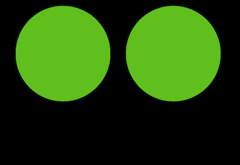
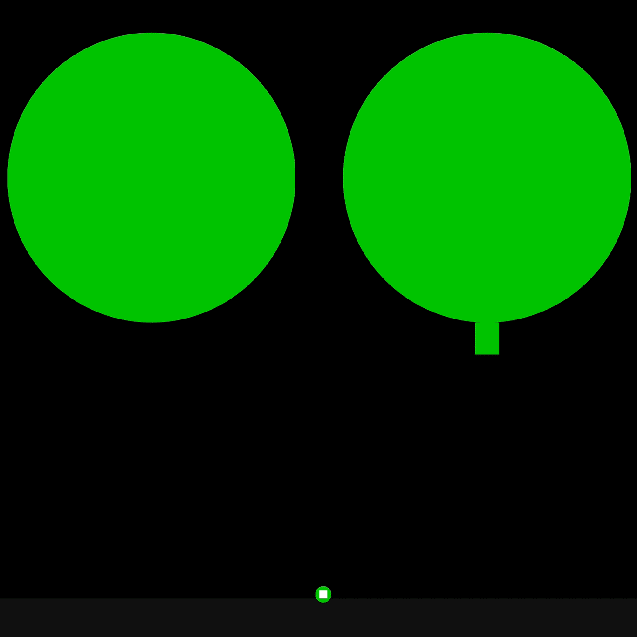

## May 13 2024 - MORNING

Welcome to my second project in master’s thesis. Here I’ll be exploring about sex, physics and humour which should be really COOL. I’m doing this project in partnership with Club Sexu thanks to good old Elspeth McConnell (a small Concordia grant supporting projects with non-profit organizations). The idea is to make a sexy funny game about pleasure, listening to your partner and exploring pleasure with them. Them being a webpage. How can you pleasure a webpage? The entire page? 

I’m will be using matter.js as part of this project and taking inspiration from the relief humour theory to make it funny. 

Brainstorm 1 -

Relief theory + sex + physics engine…. this all seems to make sense. 

The relief theory explains laughter as a release of pent up energy. Like something hat needs no be exteriorized in response to maybe mal aise or taboo or being uncomfortable…. For me this makes me think of an orgasm almost. And matterjs seems to be a good library to explore this through in part, because well it deals with physical things, litteral bodies, and friction and other things that are all part of the sexual language in a sense. So yeah. All this feels tied together in some sort.

I’m also directly thinking about my first ever programming project, “the most incredible programming experience in the world” or something like that, I don’t really remember to be honest. In this really simple project, a series of animated interactive slides would appear one after the other, the player has to click to go to the next one, or do somekind of weird simple activity. Each slide would be talking about what the project itself is, like a trailer of some kind, saying things like “what you are going to experience is the most exciting thing to ever happen to programming…” and building up more and more expectations about what that thing would eventually be. Acoompanying this (very importantly), is the song Opus by Eric Prydz, which already is hilarious because of it has the longest most intense montée in a song that I ever heard. All in all the player starts to find it funny I THINK because everything builds up and they cannot wait for what is going to happen, which is nothing basically, but the point was to make them invested and believe that something huge was coming.

I think playing with a similar arc would definitely be something to think about, a sort of build up. A sexual build up of sorts. Makes me think of Robert Yang’s stick shift, where you have to stick shift a manual car for a dude that gets off more and more as the vitesses go up from 1 to 4, but you have to be careful because if you make a mistake then you start over. 

Im thinking of creating a page, where you have to explore to make the page more and more horny, by doing various things to it. I KNOW IM COPYING PIPPIN BAR. But mine wouldn’t be an interface. The window you are pleasuring would be more experimental, and you would need to explore it to find out how to turn it on, using different things on your computer. Like tickling using the keyboard. Rubbing it in certain ways, maybe even talking to it. Basically get to know it through physicality. There could be sex toys made with matterjs as well. I could start by making a series of matterjs sex toys haha. Yes. Yes yes. 

ANOTHER idea that I would like to implement in this is pop ups. I really want to do something with pop ups. I love them. Maybe opening a bunch of pop ups and closing them in the right order makes the page horny. Or maybe slowing resizing them. OMG thats good. This is actually giving me an idea : you can make a pop up open more and more if you do the right thing, and this pop up reveals something of sorts, a hole maybe? in which you can use the matter js sex toy to pleasure it?? I like the idea of using all the affordances of a web page to make it horny. The sound design of this is going to be awesome to make. I want hot genderless machine sounds. 

I also dont want to make it too interaction designy, more like a weird colorful experience. 

So yeah :

- An arc that pents up energy with a final release
- Browser affordances as sexual foreplay (opening a pop up slowly)
- Matter.js bodies as sex toys or mecanisms for giving pleasure
- Minimal design, basic shapes and colour palette - reminiscent of sexual shapes? metaphor for sex through visuals.

BASICALLY : The player has to *listen* to the webpage in order to pleasure it. It talks to the player through pop ups - and the player has to adjust its behavior in order to make it through the experience. The player also gets asked questions so that both feel they are building something special together? I think it's nice to create something that makes the player feel like their pleasure is also taken into consideration by the page. The page can ask the player if they prefer opening the window fast or slow, or what kind of tools or action they like (or preferred) so they can also feel like their voice is important in building the tension. Try to create a sensation of togetherness, working together. 

Things that happen in sex : 
- Having to take a break to talk
- When you really connect you cum faster
- Sometimes toys or narratives or roleplaying can help to get into it or build connection
- Trying new things can be exciting
- Doing things you are used to can be comforting 
- You remember what the person likes and do it again and start liking it as well 

actions that could become sexual:
- Dark mode = more kinky? (faster or more rough things)
- Typing keyboard fast vs slow = finding a rythm to pleasure the page
- Opening, closing pop ups with a rythm as well, or in the right order
- Pressing buttons 
- Resizing pop ups 
- breathing heavily = growing in size or pulsing rapidly 
- Sounds = breathing and groaning but in a computer way (robot ish?)
- MATTER.JS :
  - The page drops toys and player must do something with it
  - Mechanisms to give pleasure 
  - More the meaty part of sex? Everything else is foreplay but when using matter.js it is more intense in reactions from the page
  - Mechanisms that are sex without being explicit?? But they feel like sex? 

Where do I start. I feel like I need to experiment for the week with a bunch of small things, and by friday I need to have a scope for this project with deliverables. Ideally this project will be somewhat complete before I leave for ICELAND. So what are the first experiments I want to make. I feel like I have to think of it as the player will experience it a bit. I'm thinking the game will probably start with a couple of small interactions. And become more and more complex until the page (and the player?) cums. 

So. First experiment. Make a page that opens up a pop up and the player has to open it fast or slow according to the color changes of the background color. Ok makes sense. Yes. Lets go. do this. 

## May 15 2024 - AFTERNOON

Todo be4 stopping work -
- Have 3 levels implemented
- A gauge instead of numbers
- A start button that opens the window and starts game 
- a signal faster, slower, good...
- "Resize me" in the window 

## May 21 2024 - AFTERNOON

ATM I have a system where the user has to resize the window at a specific speed, depending on the level, and it feels linear in a way that is a bit boring, from slow to fast. Feels correct to start slowly, but maybe there could be more randomness. Like start slow and probably end fast, but in between, alternate between fast and slow?

Other thing that is boring as of now:
- The communication system of speed is just words printed and changing erratically between slow, good and fast, and there is just a simple gauge going up and down. Its not super interesting and dynamic imo. I have this idea of communicating with popups...... Dunno what could be fun.
- Also, there is no physics at this point, which doesn't really respect the whole idea of using matter.js .................
- Theres no sound........... 
- I hate it here
  
  What to work on :
  - How to communicate the speed the player should resize in an interesting way
  - How to communcate progress or bigger changes in speed bracket
  - Incorporating physics
  - Incorporating sound

I guess at this point I could also maybe take a step back and think about what this IS in a sense. I feel like its lacking a direction and narrative which is fine because for the most part at this point I just wanted to test the mechanics of resizing at a specific speed and see what that could do, but now I think I need a bit more meat around that to make it funny. I think the funny would come in as how the pleasure is expressed by the page to the user.  

Ok so I just went to play "It is as if you were making love" and it is literally the same thing that I did except for me it is about resizing. UHHHUHUHUHSUAHDIJNASJKFNDJKSNFJKNSAJKFNJ. 
OK.

OK. 

ok I need to start something else because I am feeling not good about all of this. Ok. 

I need to rebrainstorm. And read more about the relief theory and start working directly with matter.js.

## May 27 2024 - MORNING
I decided to actually take a step back in terms of I wanna say originality or innovation? I felt like I needed to go back to something more contained in terms of starting board. So here we are, with a 800x800 p5js canvas in the middle of the screen with a matter.js engine running. It made me feel safe to feel in control of what was happeing, not having random popups and weird mechanics that are hard to make safe or working for users. Ultimately I want to try to get away from being constrained to a simple canvas but I think for the sake of this project (making something that will work as research about humour and matter js, as well as work for Club Sexu), I need to scale back in terms of weirdness of mechanics and stuff. And also, there is now a bigger focus on matter.js as a library.

The first thing I wanted to do was to make anal beads. Hahaha. when visiting the matter.js website I kept seeing this:

And I've really been thinking about making a chain as anal beads coming out of a butt, where the user has to pull it out basically, or even putting it back in? Altough this seems more complex. 
Anyways, so I did this thing and it sort of *works*.

 I like it but the mechanics are not perfect obviously. Right now its too simple to pull it all out at the same time. I think my goal right now is to add some sort of realism to it, reactions and sounds but keep the visuals really minimalistic. I think it would maybe be nice to have to again adjust the speed, or maybe even rubbing the butt before popping one out. Something. Like it is stuck in there and you have to do something to get it out?

I want to implement a small simple game mechanic and focus on making the whole thing really sexy. I want like ASMR sex sounds haha. 

Alssooooo. I got this idea of like MAYBE playing on the porn website aesthetics... like there's always CRAZY taglines and phrases and ads and stuff. I think it could be funny to play into that. Things like:
 
https://www.youtube.com/watch?v=lYPS_r8773o

Ok I need to start a list of taglines of ads on pornsites :
- "Hey you, do you want to masturbate but don't have a partner? 
- "This is so much better than watching a porn video...If you tap, you will cum!"

I'm thinking about having a couple different small experiments like this one, that combined would make a small game, or maybe just building off of this one and making it more complex? We shall see. Club Sexu would also play a role in deciding the sort of final form of the project, even though I could branch out of that at some point if it prevents me of making something that would feel benificial to my research. As of now I feel the freedom to explore everything I would do if this was not part of a contract.

## May 28 2024 - MORNING

Added bounce to the bum to make it more realistic. At first I thought I was going to just make them vibrate of some sorts... but then uppon stumbling again on the matter.js home page, i saw a demo of a chain as a bridge. As I was playing with it, I tought: OH!! I should take advantage of this bouncing in matter.js for the bum!!! 

So I made a chain like this one but with only two circle particles instead of a series of rectangles like in the example. Both ends are then tied with invisible static constraints. I then had to adjust the stiffness and length of each constraint. I also adjusted the density of the beads and the bum so that the bum would have the perfect bounce when going out. I also wanted the beads to not completely separate the bum, so I needed to test a lot to make the perfect sensitivity when colliding. TADAM :

## June 3rd 2024 - MORNING

I added collision filters to all my bodies, because at the player could click on the bum and pull it, and the cheeks would then separate and reveal that its just two circles. I needed to deactivate the mouse on the bum. I also added started running into a problem, where the player could slide the balls on the side making the entire toy slide sideways and come disappear entirely. I decided to try to build a sort of tunnel with two static rectangles, and adjust the masks of the collision filters to deactivate collision once the bead goes past a certain point in the canvas. I also switched to a longer canvas to make it easier to pull down. 

Next is color, sounds and slap on the cheeks when clicking.

## June 5th 2024 - AFTERNOON

Initially I had decided to continue the anal beads experiment, but I felt like I should start a second one, because I had an idea and felt like I should try it fassst. I'm realizing that I can try things pretty quickly now. I should prioritize this instead of really focusing on details. I mean right now I sort of have an idea of where I want to go with this:

"Are you alone?" is a collection of 2D interactive erotic web experiences. Inspired by the absurd nature of online sex games promoted as invasive popup ads (on porn websites?), they result from a research-creation process exploring the use of humor theory as a motivating material to design interactions with different JavaScript libraries. Developed in partnership with Club Sexu, "Are you alone?" provides a subversive, playful experience for the user at the intersection of eroticism and humor. This iteration uses Matter.js, a physics engine for 2D physics on the web, to facilitate playful interaction. SOMETHING ALONG THOSE LINES.

Like theres a menu with the choices, and there is the voice on loop saying "ARE YOU ALONE? You won't last 5 minutes playing this game" and other similar catchphrases. then you can open the games and play them maybe in different popups? 

ANYWAYS i just wanted to write this somewhere but here is where I am at in terms of actual work.

## June 6th 2024 - MORNING

When I was first doing the anal beads, I was trying to work with matter js composites for the first time to make a chain instead of manually building it from individual bodies and adding constraints. I took an example from the documentation and ended up doing this:

And I thought it looked almost liquidy, and I thought if I add some ellipses then maybe we will get the illusion of something more organic, like a soft thing. I knew something interesting could be done with this but I put it aside to work on the beads again. But then I decided to think about what I could make with this: A SOFT PENIS!!!! Soft penis are like already funny in a sense. And you also don't really usually to play with one. I also really fast decided to add a cloth on top as a sort of skirt that can be pulled up? I thought, that could be the sort of "game" of this one. You can play with the dick but also reveal it from under the skirt or something. It plays with expectations and would add a surprise element. I'm thinking the static ellipses at the top could be buttons that if clicking on them, they unbutton and the cloth falls and then you can play with the penis. Of course in this case the cloth would be opaque (checkered? like a kilt).

So I was playing with this idea, testing different things, making the penis heavier, longer, shorter, to see what felt most realistic. I started adding visual details (a cock ring, a more pointy head) and then I made a mistake working with collision filters and the cloth started to come in contact with the penis, sort of holdins it together, creating a 3D-like effect of a mesh underwear holding a giant shlong and I think this is where I crossed the line of comedy and went to the sexual side. 

It was weird because it was hot and I thought it was funny because I was surprised by it, and the fact that it is over sexual makes it funny im my mind (but maybe only because I'm making it?), but not in all context??? Like it's funny because I'm making this and it's going to be presented out of its context, but if this was on a porn page, I don't know if people would necessarily find it funny. I think it still is but I realized that I needed to cut back on making it realistic. I feel like I pushed the realism too much and the humourous line playing off of the ambiguity between sexual and abstract wasnt so blurry anymore. It was funny because it was crass and very sexual. The subtility was gone. It was just a big floppy dick instead of something suggested. I'm not trying to make something ACTUALLY sexual. Well. I think it's nice if you have the choice to find it sexual or funny. And if its too realistic than its too much on the sexual side. Compared to the first one (beads), the simplicity of just using circles and lines made it perfectly straddle the line of sexy and funny. Like you could play this in public. This I would not. IMO this means that it strays away from being funny. I decided to pull back and see what was up without the cloth, but even then, I thought there is too much details and it crosses the line on the sexual side. ALSO I think that each "game" should have one "toy-like" element, and here the cock ring is not interactive, but still a toy, making it a bit confusing and not necessary and also constributing to making it very sexual. 

So I pulled back again and now I'm here:

I like the simplicity of this, and I think that with the skirt element this could be really fun. I really want to make the skirt NOW but since I know its going to be awesome I'll wait for a day when I'm depresed to do it, and since I have good energy, I want to try to start making a third one with a vulva. I think this is probably going to be more challenging, because first of all I don't know vulvas too well, and also I think that they are not necessarily funny? Like a soft dick is funny but a vulva is not? So yeah. I think the first thing I actually want to try to make is a vibrator. I think that if I make a chain with really tight constraints it creates a vibrating effect and I think it could be interesting.  Moral of the story : realism is OK in terms of physics (makes it funny), but realism in terms of visuals is a thin line to make things overly sexual. ALSO, I think sounds will play a big part in making this more ridiculous. 

## June 7th 2024 - MORNING

Vulva - Taking a break for today because I felt KINDA lost, but I was talking with my friend while playing with my sketch and got this idea of making the clitoris a joystick to control something, like a spaceship or something else........ This TRIGGERED an idea, where all the games would be interconnected in some way. Like maybe the clitoris would control something to make the dick do something? Like a frenzy of absurd stuff, sort of a big sex puzzle of sorts..... haha. Feels a TAD weird to write about this for school. 

NEW IDEA: BOOBS. With a chain connecting both, and when they are both connected, electricity (strobe + colors and sparks and boobs flying everywhere??) So yeah making the snaps and the small chain between both. So yeah starting on that this morniiiiiiin. lezzzzgoooooooo. hihihihihihi.

## June 14th 2024 - MORNING
Reaaaally big week this week so here is a rundown of things.

### VULVA SKETCH:
Like I said earlier, I kinda dropped it before but wanted to show in gif where I had dropped it. Clitoris-like situation with a vibrator of sorts that you can pick up to stimulate... Not much going on there. I think the joystick route could be really interesting. Also I'm trying to be politically correct because I made a dick and now I feel like I need representation which is not good fuel for funny IMO. Still I think it's important because I risk running into ethical problems which will make the whole thing probably awkward and unfunny. 

Other interesting thing: I started to record my screen evrytime I add something to the sketch. Its annoying and time consuming but I'm curious to see a sort of timelapse almost of things? I started with vulva and sort of did it with boobs. The goal is just to document more whats happening. Theres a lot of stuff I'm realizing I'm not necessarily writing down or I'm trying so many things that It's not really possible to remember everything. I think having a visual could help me document better my work. I'm actually thinking I could screen record while I'm making, But I think my computer would crash and be so slow. I could possibly look for tools that are less performance consuming than screen recording with quicktime. 

Thing I wanted to meditate on : 
At one point I thought : Is the vulva even funny? I am biased in thiking its not? Is it a form of systematic underground misogyny for me to see the dick as funny and the vulva as serious? I mean i feel like a dick is genuinly funny, especially a soft one, its so ridiulous and I dunno like its easy to personify as something like a sausage or what not. And a vulva is so complex and interior........ I had a feeling that I had to "respect" its anatomy if I wanted to go on that teritorry because people usually don't care or respect it, like its well known that men don't know how to make women cum or something? Also I'm gay so I don't have as much experience with vulvas as I do with dicks? Which maybe makes me able to laugh at dicks and less at vulvas??? I feel like its wrong of me to not want to make fun of vulvas, like wanting to be nice to them because they deserve it? Like a tacky forced chivalry or something which is gross. ALSO, I've played sex games for inspiration and its literally a pussy with something going in and out, like a toy or something, and that's not funny? Like I need something more special than just a normal, anotomically correct vulva that you can stimulate........ Or it becomes just a normal porn game. I feel like the way to go with this it like i've said before, the joystick option, because it plays on the fact that the clitoris is somthing to be cared for in a specific manner, and ALSO, it gives power back to the pussy as somthing that controls something else, as opposed to being just recieving whatever happens without any control over it.... I feel like in porn in general its usually the opposite, and I think if I want to make humour out of this one I need to go in a direction that is subversive to how it is already represented. 

### BOOBS SKETCH:
 Obviously I was thinking about making boobs since the beginning, two circles bouncing, much like the butt of the beginning, seemed like an easy thing to do. So I did not do it at first because I thought I wouldnt be surprised enough to be excited about what I’m making, (which is what I think ended up also happening with the vulva episode…). I need to be laughing and excited (feels new) to be going for it. OR it needs to be impressive in a way that exceeds my expectations. Im trying this new thing where I document ALOT, I screen record everytime I'm adding something and I make a gif out of it. I think its nicer that to just explain it through writing. And more explicit? Its really long but I kind of don't mind for some reason. I think it looks nice and is maybe a way for me to feel more comfortable about MDM. This way I feel like i'm reaaaly thorough. So let's go through a little round of what happened :

Trying out a stack of rectangles chained together with a chamfer to make a rounded corner? What do boobs actually look like ahha. Didn't feel it.

  

I was a bit confused about what I actually wanted the boobs to look like, and sometimes when I want quick inspiration, I just type whatever I'm looking for on google with p5js following, and theres usually scripts on the online editor that point me in some direction I had not thought about. So I typed "Nipples p5js" and found this : 

  

  I thought ah this is funny and very simple. Why am I trying to make something very realistic? I think I forget that this is not what I should strive for at first. I need some kind of visual goal before playing with physics. I think this usually happens because I realised that when making a new sketch, I copy the one I made before (in this case the penis one because I thought I would use a similar concept but with tighter and shorter constraints). But this limits me!!! Stop doing that!! Actually I'm thinking right now I should have a boilerplate and start from there each time. Anyways, so I decided to go back to basics like always, which is usally a good thing. Because I have to focus on one thing at a time and add on to the thing. Now I was focusing on the visual aspect as well as the physical bounce and such. Made me confused and not happy. So I literally started with two circles. 

  

Then I added the a chain stack to each circle and a line with the same weight to make a sort of worm-like effect when pulled (again, old news), to each circle. I also added a chain that is the small circle falling. its all in one spot but if you click on it you can see it unfolds (you cant see now but later I think yes).

 

 The nipples are the eyes of the face!!!! First nipple. Its an actual matterjs body not just drawn on top. My initial idea was to use it as a sort of thing to clamp on? Looks like a balloon.

 

 Ok so at this point I started playing with how I wanted the nipples to look like, and decided to make then on each side, slightly angled outwards and with rounded corners. I chose to make them more on the side instead of straight down because I thought with the chain it would be more interesting, instead of clamping at the very bottom. At first they were both pointing in the same direction which I weirdly liked but ended up making them symmetrical. I also made a clamp with 3 rectangles as a composite, my first time, which was nice. At this point I tought, the player will just try to put the clamp on the nipple directly? So I made the clamp a bit bigger in order to fit the nipple inside like in a container almost. ALSO. I kind of was not feeling the fact that they were round perfectly, so I decided to make the constraints longer, but then in their normal position they looked like sort of pills? Which was ok but I tried to think of something a bit more human. I got the idea of creating each ellipse in the stack bigger everytime (like 5 pixels or something), creating a sort of pear-like shape. I felt like this was the perfect sweet spot of realism/minimalism aesthetic I had going on since the beginning. 

 ;

 BUT. While making the clamps I was like : ok this is what I see in my mind but what will actually happen when players will pick it up and try to grab the nipple? After playing with it a bit it was cumbersome to position it on the correct side so that it encapsulated the nipple. The game was actually hard and there was too much room for error. I also had not even figured out how they would stick there........ I didn't want to just stick them in a way where the physics would stop working. So I needed to work with matterjs existing options. So I took a step back and created a simple circle the size of the aerola, and tried different things to make it stick. And it started working!!! Using SetVelocity to 0 and SetPosition if the circle is close enough to the areola. It also was suprisingly sticky! The boob doesnt react when pulling on it but I will definetly be adding this to add to the realism.

 After that I added a chain and an ellipse to both ends, and I actually really like way it looks? And I'm thinking of keeping the ellipses as sort of stickers instead of clamps, maybe with bolts on each of them to signify electricity. So here is where I am at with the boob sketch as of now:

 

I think what I'm realizing now is that when deciding to make something for this project, is that it becomes funny at one point. I don't know exactly when it will happen, I think I'm not really focused on making things funny per say in the first few moments of making. But usually pretty fast I know how to exagerate a feature or a mechanic or something to try to make it funny. I think in most cases the fact that the body parts are have physical properties (bounce and shape) makes it already comical paired with the minimalist aesthetic, but I think there needs to be an element of surprise in each of them to really push it to the next level. In this case I'm really counting on the electric chaos of it all. I'm basing myself of a demo in matter js where bodies go wild based on an event : 

I'm thinking when both are connected ! OHHHH I juste also remembered where I got this idea from ahha. Fantastic Mr Fox!!! (the most amazzing and cool funny movie of all time (srly probably one of my 4 fav movies)) 

I think the humour will explode here. I think ACTUALLY that it is all very fitting with the relief theory. A situation AT FIRST is very sexual and strange and already a bit comical ish? And then a surprise happens that pushes it over the top (in this case the electrocution), that sort of breaks the sexual (not entirely) energy and that is where it becomes funny? I feel like that is how the theory is explained. So maybe the boobs could be something similar. 

### PENIS SKETCH:

I'm following this person on Instagram that is going through Schiffman's Nature of Code but using P5, and publishing their sketches as they go. They have been into physics lately and posted a sort of liquid simulation using particles.

This is literally sperm. 

I made a bit of research and found an example of this on code pen: https://codepen.io/rudtjd2548/pen/mdjWjaP (used as milk)

Basically, it is a blur filter applied to the the canvas, making the particles visually all stick to each other in a blurred out way, and then a high contrast one to bring everything back crisp. So you end up with a crisp sort of liquidy look, like both effects are added separetely. 

So basically it is just particles with a SVG filter on top of the canvas. So I started to try to make this. Of course I started to do all this on the penis sketch, even though I thought this could also maybe be used for the vulva OR a new sketch with a mouth? I did think that this could turn out realllllly too crass but also thought it could be hilarious as a surprise. But yes the initial idea was to pair it with the dick. The first day it did not work at all which was frustrating, I could see the filter applied around the edges of my canvas but not on top directly. And also I did not try to put the particles... I was so mixed up.

I started by making a bunch of particles appear on mouseclick : 

;

Okay next step, I tried to figure out the freaking SVG FILTER on top of everything, but I couldnt understand why it was not working. Again, I could see a sort of blurry rectangle with round corners around the edge of my canvas, so I could see SOMETHING was happing. It looked like it was underneath the canvas or something. I can't remeber if It was by asking ChatGPT or a forum, but I tried to clear the background using clear(canvas) which clears the cavas before it is redrawn every frame, and I turned the particles black, and BOOM, it was working.

;

The thing is that now the whole canvas was affected by the SVG filter, which was actually interesting and made for a cool sort of oil and vinegar feeling that I won't be using here but could be cool in another project.

;

So yeah. I needed to figure that out. My first instinct was to create an image using createGraphic and draw them there, which worked but I still could apply the svg to this graphic because it did not have its own canvas. I decided to make two p5 instances, so two different canvases, drawn on directly on top of each other the same size, so that I can draw things at the same position but would technically be layers and not the same sketch. The background one would literally be everything, including the creation of the matter sperm particles, and I would pass the position of the particles to the top top layer, which would have the SVG and only draw the particles with a transparent background using clear(canvas). This ALMOST worked, but then I ended up not being able to access with the mouse the background layer with all the matter engine, because the top layer was blocking mouse interaction. SO. I thought Ok im going to switch the engine and matter bodies and particles to the top layer with the drawing of the sperm particles, and pass the position of the penis and balls to the bottom layer. So I started doing that but as I was starting the process and transfering the basic matter engine stuff, I pasted the mouse contraint stuff to the front layer and had to change the canvas target and I thought ! OH ! Maybe all I have to do is change the target and yes it was all I had to do. So I put everything back and just changed the mouse constrain target canvas. I also had to deactivate the collision beween the sperm particles and the dick and balls, because it was really chaotic. Im thinking of maybe reactivating the balls so I'll try this next time. A few last touches I added that are just cherry on top :

- Deleted the gland... the way the sperm was coming out was not working with the wierd elongated ellipse on top of all the other ones
- Sperm only works when clicking on the penis (using mouse events from matter)
- I adjusted dynamically where the sperm particles are created on the penis based on the mouse position, because I didnt want them to stay in the middle when pulling it up, down and sideways. Now it moves a bit in the direction of the mouse, so it feels a bit more realistic.
- I added a force to the sperm stream depending on the mouse position. I wanted the penis to shoot the sperm, because before it was always shooting down even if it was pulled to the side. I found a cool mathematical algorithm for that on a forum (I put the link in my code)
- I added a second particle stream with a smaller particle range, like little droplets. This makes the flow thicker but also more liquid as it seems like there are small drops separating from the bigger stream and falling faster. I also played with gravity and air friction to achieve the perfect texture and weight. Its gross but so good.
- Last thing! I used a plugin because yes they do have those and I want to look if there are other plugins that speak to me, to make the sperm wrap around the edges of the canvas. Its working so good. It feels even more grotesque.

Here is the final product (i am so happy about how weird this makes me feel)

;

SO. This is so funny if I'm honest. It looks in 3d haha. Its so weird. Its such a good surprise to just handle the dick and this starts leaking out.

 I think this is all for now tbh. I wrote all day and I' so tired. I think evrything is there for now. I will maybe try to write tomorrow about other things (I have a couple notes I want to dive deeper into).

 Bye.

 MDM quick notes:

 - boobs should be less volatile, still move but more static.
 - The nipples should be more important?
 - Soft bodies seem like a good avenue?
 - Change the design to something a bit more 2D - like maybe the boobs are like mountains at the bottom
 - Zero Gravity for this one?
  
  ## January 27th 2025 - MORNING
  
  Coming back to the project after taking a loooong break. Couple things to mention:

  - Working with club sexu, we decided to use the toys as interfaces to interact with content from their website. For example, they have an article on anal beads and safe use of sex toys, so the anal beads would be used to interact in some way with the article, like reading parts of it for example
  - They shared 3 articles that fit with three of the games, anal beads, penis and nipple stimulation, and split them into small excerpts
  - Working with anal beads first, I decided it could be interesting to have the excerpts of the text into the beads themselves, and how to literally pull out the information of the butt. The user would hover over each bead, the bubble would grow and the text would appear. I first tried to do this in P5 directly but it was annoying to manage the text in p5 instead of in html. It was cool but something was sort of bugging me visually. Like if i was corrupting my original game that I thought was perfect, the motion of the beads, the bouncing of the butt. Having the beads grow and shrink made it feel less physical, less realistic and minimalistic. It lost its sort of basic simple bouncy charm. I liked the idea conceptually, having the information in the beads and pulling them out, but also the hovering was a problem because beads were growing and shrinking all the time, and also the ones that were just out of the butt but close to them was also growing and shrinking and broke again the realism. Something I figured was not helping, was that it was only the visual content that was growing and shrinking, and not the actual body of matter js. I feel like that was why it felt not aligned with the energy it had. But I decided to stick with that for a while.
 - For the penis, i really wanted the text to appear as the sperm was filling up some kind of container, so i built 4 containers in each corners, and when being filled up, reveal the text on top. This is not working yet, and also filling up the 4 containers requires a lot of performance and makes the game really slow even on my computer. ALSO, on mobile this would not work, because the penis would be super small if the canvas was a square. I prefer filling up the "phone". I need to figure out how to do this without losing performance. I'm there now.
 - Boobs one, did not work on it, but thinking about making it about nipples instead of boobs. More gender neutral.
  
  Anal Beads {
Does the interface need to also be the content? Or could they still be separated in a sense... I decided to separate them. The info in the beads was really annoying. The card system is way more clean and easy to manage. I have a feeling that its a bit of a copout but really i think that this is the closest to being integrative as i can between weird and pragmatic. 
This made me think about context being resistant to playfulness. I'm also managing the balance between art, emotion and provocation and pragmatism. I think there is a huge gap between both, like in windows and mirrors, and right now im trying to make this gape smaller and this is where i've landed. I wish i could close the gap completely but im lacking time right now and want to finish this project.

;

When i decided to switch back to pop ups of info instead of text in beads, I thought about using jquery and i even tried implementing it. I thought it could be nice to have the info be dialog boxes popping up, but after reminding myself that these games have to work on mobile, I realized that it would not be an easy manage. I deleted that and decided to make a simple info card, using css animations to appear. Each bead would have one card with different text. The card would appear on top in the middle and would sort of be a modal, where the user cant interact with anything until they press continue or arrow button or something. I headed over to club sexu's instagram to get inspiration on how to design the card. I found a nice one.

;

So I proceeded to do the same thing ish and added the cards to the program. Meanwhile I met with Club Sexu and they sent me their brand identity colors and fonts. I decided to try something out. I really want to brand it club sexu beacause I think this will show that i can adapt to make cool weird things but for companies or people. $

I fixed a small problem that was there for a while: because the chain was becoming so long now, the part inside the butt was falling to the side and passing the pop threshold but outside the canvas, so i decided to elongate the tunnel that is holding the toy straight so that it is holding upright until the very end. i think it made it more stable as well and less glitchy. Dunno why i waited so long to fix that but i got the idea in my bed sometime. 

I realized I was doing 3 jobs at once : graphic designer, interaction designer and developper. Most of this for the first time, and all mixed together in weird orders. All these design decisions in all these 3 fields influence each other and make the whole thing more me and expressive. I think of it kind of like making a movie that you write, direct and edit yourself. Isn't that always just so personal and interesting? I think that makes the interace feel very special. 

BUT. Being slightly colorblind and hating CSS, i did reach out to my friend and amazing designer to help me with the color stuff. Still waiting for his response to make the "final" first version. 

- Random thought: designing humour has to be personal, like a series created, written, directed and acted by one person but this can also happen with any other emotion: you need to feel while making the thing as your working, and in my case it is humour. Maybe look for emotion and vulnerability in MDM?
- Humour, you have it or not have it? Can you really make unfunny people make funny things?
- MAYBE not, but you can make them feel free… whatever that means?
- Sometimes I think maybe its not about humour per say, but creating personal interaction design for people to use that are not homogenized and yes maybe cause friction because the usability has to share its place with emotion and expression but even if it takes time to do something, it makes people be aware of what they are doing instead of having a seamless experience aimed at productivity. It creates a break into what they are expecting. Sometimes things don’t have to be so cold and fast. maybe you need to slow down and play and be invited to think differently about the way you do things and to think about the thing your doing instead of not think about it (computers dissapearing = norman vs computer not dissapearing and becoming mediums)Design friction and hartmut rosa? I should watch the interview (you know which one)
- Like maybe its not about making something perfectly seamless, because this erases the playfulness and the emotion and thought, maybe its about finding a balance and letting people deal with the thing. Like it has to feel intuitive but also retain its artistic qualities and not be overexplained. 
- Making a didactic interaction is like explaining the joke to the user, it erases the surprise and thus the humour and laughter that could happe. This impacts the usability of the design and yes maybe makes it less easy to use but I think we need these kinds of designs that are not meant to provide seamless experiences and aim towards productivity. Maybe you need to figure it out and be a bit frustrated or encounter friciton, but adding friction is about adding life and humaness, and what is more human than humour itself? This is why its so hard to talk about making it in design or it is a challenge to do it with AI, because humour has nothing to do with automation or prediction or instructions or rules. It is about being embodied, being human, being sensitive, thoughtful, empathetic, all those things that are required to make interaction design more human. 

I started working with mobile straight away because they really want the game to work on mobile which I get, and also I think its more cool to play with matter js on mobile using touch, it adds another level of playfulness and subversion (literally touching the penis with your hand) So yeah now im developping on mobile as well ahha. 

There are some really annoying differentces on each browsers and mobile... like sound doesnt work on chrome mobile for some reason. All details i should fix soon. 

Also should have something happen when user switches to landscape with phone because it screws everything. 

So. Thats it for now. I will def try to be more MDM. promise.
  }

  ### To Do Today 
Anal beads:
  - Fix item number on info cards. Should be going from 1 to 9 [DONE]
  - Add hover/click css animation to button [DONE]
  - Make cursor hand that grabs when clicking to help understand [DONE]
Penis: 
  - Start mobile version